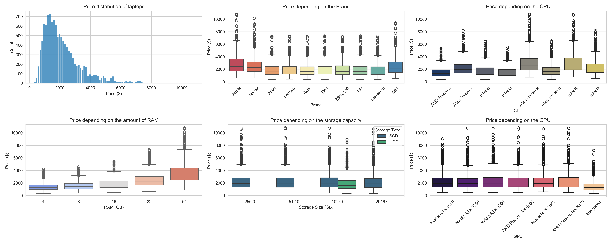
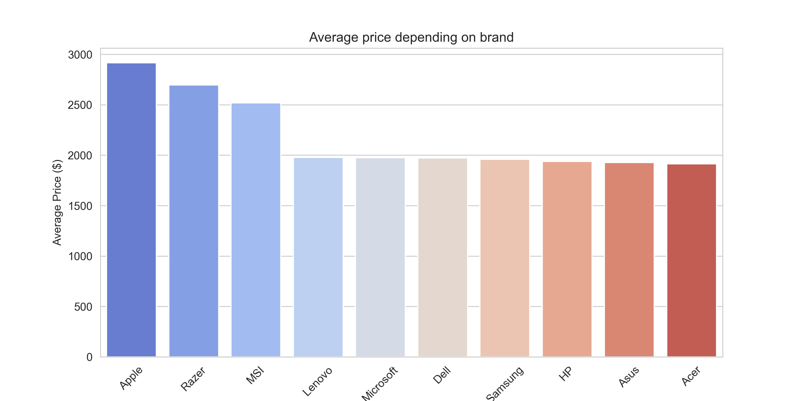
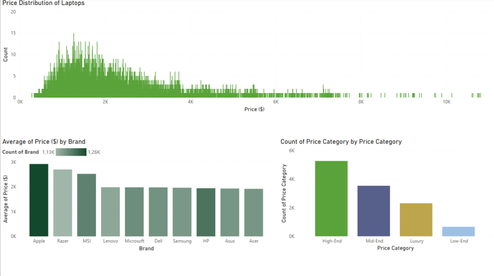
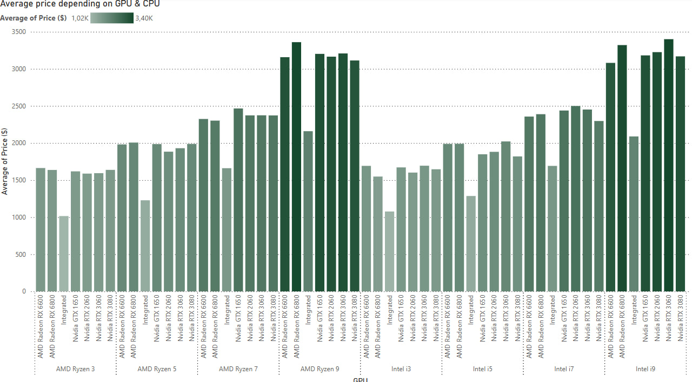

# Laptop Prices Analysis

This project investigates which features (CPU, RAM, SSD, GPU) most affect the price of laptops. We also perform clustering by price segments and identify anomalies in the data.

## 🔍 What's analyzed?
- Effect of features on price
- Average price by brand
- Division of notebooks into segments: budget, mid-range, premium, luxury
- Search for abnormal models

## 📊 Key takeaways:
- **RAM and CPU are the most important features affecting price**.
- **Apple and Razer are the most expensive brands**.
- **SSDs with large capacities significantly increase the cost**.
- **Anomalies are found, such as a laptop with 64GB RAM for $300 (this may be due to the type of RAM or data errors)**.

## 🚀 How to start?
1. Install dependencies: `pip install pandas seaborn matplotlib numpy`
2. Open this notebook in VS Code (with Jupyter extension) or in Jupyter Notebook and run all cells.

## Key Visualizations and Analysis

### 1. Price Distribution of Laptops and Depending on Features

### 2. Price by Brand

*Description:* This chart shows the average price per brand, indicating that premium brands such as Apple and Razer tend to have higher prices.

### 3. Price Segmentation

*Description:* Laptops are divided into four segments: Low-End, Mid-End, High-End, and Luxury. The majority fall into the Mid-End and High-End segments.

## Power BI Dashboard

For interactive analysis, an interactive Power BI dashboard has been created.

### Dashboard Screenshot:

